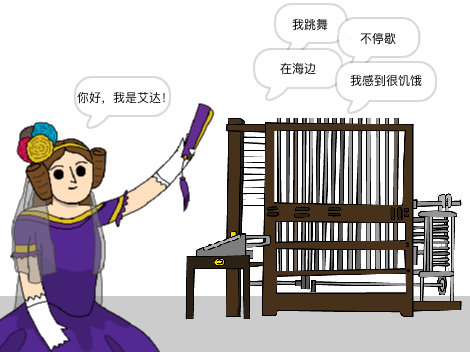

\--- no-print \---

这是该项目的 **Scratch 3** 版本。 项目还有一个 [Scratch 2](https://projects.raspberrypi.org/en/projects/poetry-generator-scratch2) 版本。

\--- /no-print \---

## 介绍

您将学习通过编程制作自己的诗歌生成器！

\--- no-print \---

  <iframe allowtransparency="true" width="485" height="402" src="https://scratch.mit.edu/projects/embed/77844926/?autostart=false" frameborder="0" scrolling="no"></iframe>
  

\--- /no-print \---

\--- print-only \---

\--- /print-only \---

## \--- collapse \---

## 标题: 你将学到什么

+ 变量
+ 列表和随机列表项；
+ 循环(`重复执行`{:class="block3control"} 积木块)。

\--- /collapse \---

## \--- collapse \---

## 标题: 你需要准备什么

#### 硬件部分

+ 一台能够运行 Scratch 3的电脑

#### 软件部分

+ Scratch 3([在线版本](https://rpf.io/scratchon){:target="_blank"} 或 [离线版本](https://rpf.io/scratchoff){:target="_blank"} 都可以)

#### 下载

初始项目在 [这里](https://rpf.io/p/zh-CN/poetry-generator-go){:target="_blank"}。

\--- /collapse \---

## \--- collapse \---

## 题目：为教育者提供的额外信息

创建该项目是为了庆祝 [Ada Lovelace Day](https://findingada.com)。 If you're a teacher, you can download a School Resource Pack which also contains an assembly plan ([downloads.codeclub.org.uk/ada.zip](https://downloads.codeclub.org.uk/ada.zip)), to introduce children to Ada and her revolutionary ideas.

\--- no-print \---

如果您需要打印本项目文件，请使用 [适合打印的版本](https://projects.raspberrypi.org/en/projects/poetry-generator/print){:target="_blank"}。

\--- /no-print \---

你可以在这里找到 [完成的项目](https://rpf.io/p/zh-CN/poetry-generator-get){:target="_blank"}。

\--- /collapse \---