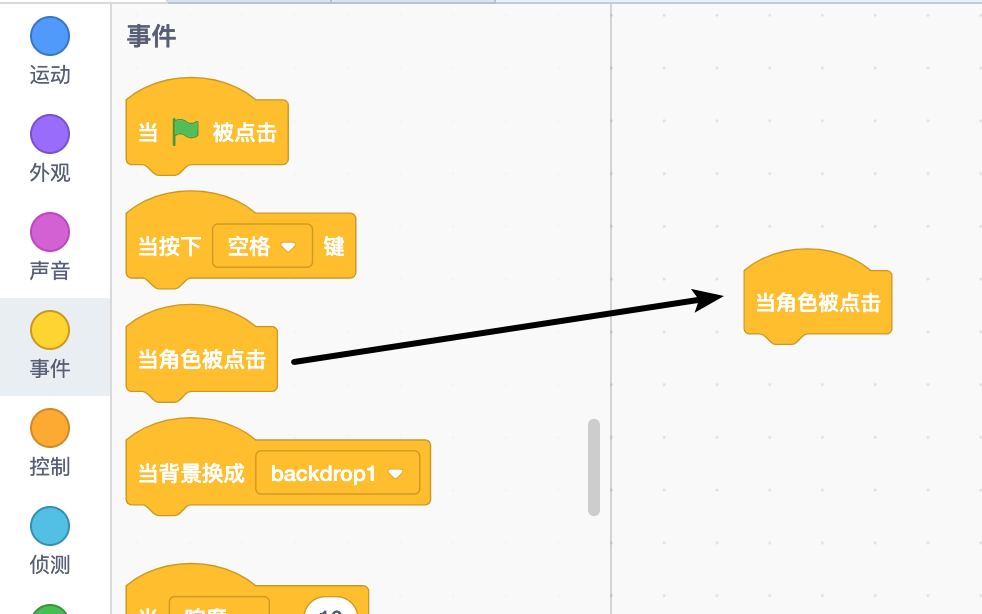
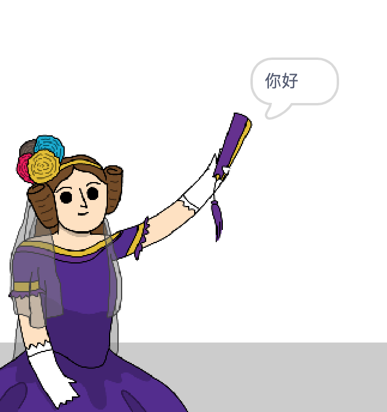

## 艾达·洛芙蕾丝（Ada Lovelace）

1842年，艾达·洛夫雷斯（Ada Lovelace）撰写了有关使用称为“分析引擎”的机器进行计算的文章，被视为世界上第一位计算机程序员！ 艾达（Ada）也是第一个看到计算机可能不仅仅是大型计算器的人。

--- task ---

打开 “诗歌生成器” Scratch 初始项目。

**在线版本**：打开 [初始项目](https://scratch.mit.edu/projects/392421881){:target="_blank"}。

如果您有 Scratch 帐户，可以单击 **改编** 制作副本。

**离线版本**：在离线编辑器中打开 [初始项目](http://rpf.io/p/zh-CN/beat-the-goalie-go){:target="_blank"}。

如果您需要下载并安装 Scratch 离线编辑器，可以点击链接[ rpf.io/scratchoff](http://rpf.io/scratchoff){:target="_blank"} 获取。

--- /task ---

--- task ---

单击 “艾达” 精灵，然后单击 “脚本” 代码区域中的 `事件`{:class="block3events"} 标签。 将 `当角色被点击`{:class="block3events"} 拖动到右侧的编程区域。




在该积木下添加的任何代码，在单击艾达时，都将被运行

--- /task ---

--- task ---

单击 `外观`{:class="block3looks"} 标签，然后拖动 `说`{:class="block3looks"} `你好！` `2 秒`{:class="block3looks"} 积木块，放入您刚才添加的 `当角色被点击`{:class="block3events"} 的下面。


```blocks3
when this sprite clicked
say [你好！] for (2) seconds
```

--- /task ---

--- task ---

单击艾达，她将对您说话。



--- /task ---