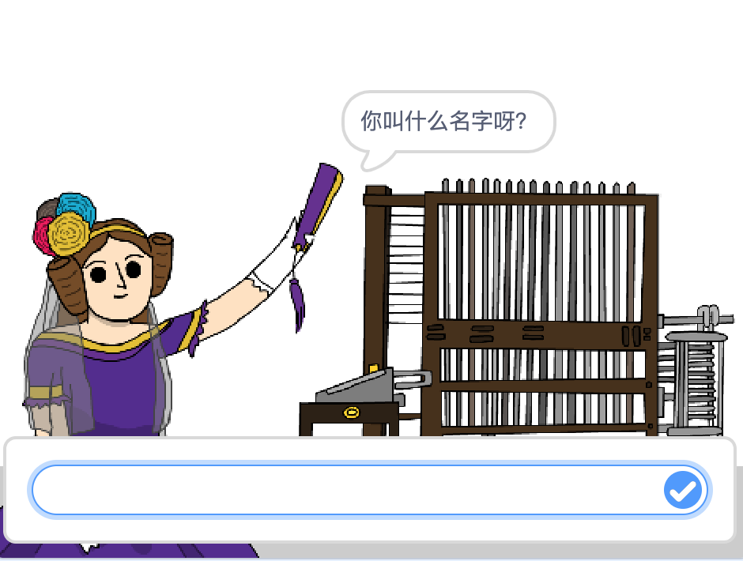
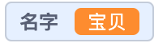
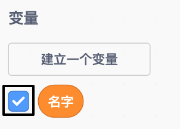
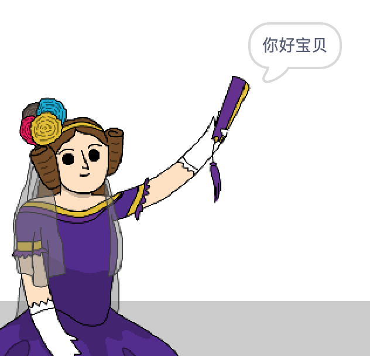

## 告诉艾达你的名字

艾达已经介绍了自己，但她还不知道你的名字！

\--- task \---

将 `询问`{:class="block3sensing"} 积木块(在`侦测`{:class="block3sensing"} 分类下)添加到您的代码中。 现在你的代码应如图所示：


```blocks3
when this sprite clicked
say [Hi, I'm Ada!] for (2) seconds
+ ask [What's your name?] and wait
```

\--- /task \---

\--- task \---

单击艾达以测试您的代码。 艾达应该会询问您的名字，等待您的输入！



\--- /task \---

\--- task \---

我们可以使用 **变量** 储存您的名字。 点击 `变量`{:class="block3variables"}，然后点击 “建立一个变量”。 此变量将用来存储您的姓名，因此我们将该变量命名为... `名字`{:class="block3variables"}!

[[[generic-scratch3-add-variable]]]

\--- /task \---

\--- task \---

要存储您的姓名，请单击 `变量`{:class="block3variables"}标签，然后拖动 `将名字设为`{:class="block3variables"} 积木块到代码末尾。


```blocks3
when this sprite clicked
say [Hi, I'm Ada!] for (2) seconds
ask [What's your name?] and wait
+ set [name v] to [0]
```

\--- /task \---

\--- task \---

使用 `回答`{:class="block3sensing"} 积木块来存储您输入的答案。


```blocks3
when this sprite clicked
say [Hi, I'm Ada!] for (2) seconds
ask [What's your name?] and wait
set [name v] to (answer :: +)
```

\--- /task \---

\--- task \---

单击艾达以测试您的代码，然后在询问时输入您的姓名。 您会看到您的姓名已存储在 `名字`{:class="block3variables"} 变量中。



\--- /task \---

\--- task \---

现在，您可以在代码中使用您的名字了。 加入这段代码


```blocks3
when this sprite clicked
say [Hi, I'm Ada!] for (2) seconds
ask [What's your name?] and wait
set [name v] to (answer)
+say (join [Hi ] (name)) for (2) seconds 
```

要创建此代码：

1. 拖动 `连接`{:class="blockoperators"} 模块，使它与 `说`{:class="blocklooks"} 模块链接在一起
    
    ```blocks3
    say (join [apple] [banana] :: +) for (2) seconds
    ```

2. 拖动 `名字`{:class="blockdata"} 模块，使它与 `连接`{:class="blockoperators"} 模块链接在一起
    
    ```blocks3
    say (join [Hi] (name :: variables +)) for (2) seconds
    ```

\--- /task \---

\--- task \---

如果要隐藏 `名字`{:class="block3variables"} 变量，点击变量旁边的勾。



\--- /task \---

\--- task \---

测试你的代码。 艾达会用你的名字跟你打招呼！



如果单词 “你好”和您的名字之间没有空格，您需要在代码中添加一个空格！(中文请忽略，译注)

\--- /task \---

\--- task \---

最后，添加以下代码以说明下一步做什么：


```blocks3
when this sprite clicked
say [Hi, I'm Ada!] for (2) seconds
ask [What's your name?] and wait
set [name v] to (answer)
say (join [Hi ] (name)) for (2) seconds 
+ say [Click the computer to generate a poem.] for (2) seconds 
```

\--- /task \---

\--- task \---

最后一次测试艾达代码，以确保一切正常工作。

\--- /task \---