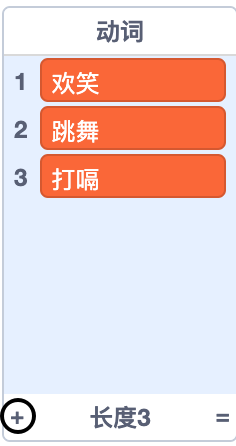

## 分析引擎

让我们对艾达的计算机（又称为“分析引擎”）编程，生成诗歌。

\--- task \---

将此代码添加到您的“计算机”精灵中，使它在单击时发出声音：


```blocks3
when this sprite clicked
say [Here is your poem...] for (2) seconds
```

\--- /task \---

\--- task \---

要随机生成诗歌，首先需要一个**列表** 来存储可使用的词。 To create a new list, click the `Variables`{:class="block3variables"} tab.

让我们在诗歌的第三行使用 **动词**(动作词)。 创建一个名为 `动词`{:class =“block3variables”} 的新列表。

[[[generic-scratch3-make-list]]]

\--- /task \---

\--- task \---

您的新列表将是空的。 点击空列表底部的 `+` 并添加这些动词：



\--- /task \---

\--- task \---

诗歌的第一行应该是单词“ 我”，第三行是一个随机动词。

要创建一行诗，您需要：

1. 在 `1` 和 `动词的项目数`{:class="block3variables"} `之间取随机数字`{:class="block3operators"}：
    
    ```blocks3
    (pick random (1) to (length of [verbs v]))
    ```

2. 使用此模块来从 `动词`{:class="block3variables"} 列表中随机获取一个 `列表项`{:class="block3variables"}：
    
    ```blocks3
    (item (pick random (1) to (length of [verbs v]) :: +) of [verbs v])
    ```

3. 使用 `说` {：class =“ block3looks”} 模块用来显示这行诗
    
    ```blocks3
    (join [I ] (item (pick random (1) to (length of [verbs v])) of [verbs v] :: +))
    ```

4. 添加 `说`{:class="block3operators"} “我” 模块到刚才的模块之前，来创建诗的第一行
    
    ```blocks3
    say (join [I ](item (pick random (1) to (length of [verbs v])) of [verbs v]) :: +) for (2) seconds
    ```

你的代码应该是这样的：


```blocks3
when this sprite clicked
say [Here is your poem...] for (2) seconds
+ say (join [I ](item (pick random (1) to (length of [verbs v])) of [verbs v])) for (2) seconds
```

\--- /task \---

\--- task \---

多次测试你的代码。 您的计算机每次会从 `动词`{:class="block3variables"} 列表中选择一个随机词。


\--- /task \---