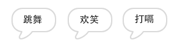

## 分析引擎

让我们对艾达的计算机（又称为“分析引擎”）编程，生成诗歌。

\--- task \---

将此代码添加到您的“计算机”精灵中，使它在单击时发出声音：


```blocks3
when this sprite clicked
say [Here is your poem...] for (2) seconds
```

\--- /task \---

\--- task \---

To create a random poem, first you'll need a **list** of words to use. To create a new list, click the `Data`{:class="block3variables"} tab.

Let's use **verbs** (action words) in the first line of your poem. Create a new list called `verbs`{:class="block3variables"}.

[[[generic-scratch3-make-list]]]

\--- /task \---

\--- task \---

Your new list will be empty. Click the `+` at the bottom of your empty list and add these verbs:


\--- /task \---

\--- task \---

The first line of your poem should be the word "I", followed by a random verb.

To create this line of poetry, you need to:

1. `Pick a random number`{:class="block3operators"} between `1` and the `length of the verbs list`{:class="block3variables"}:
    
    ```blocks3
    (pick random (1) to (length of [verbs v]))
    ```

2. Use this block to get a random `item`{:class="block3variables"} from the `verbs`{:class="block3variables"} list:
    
    ```blocks3
    (item (pick random (1) to (length of [verbs v]) :: +) of [verbs v])
    ```

3. `Join`{:class="block3operators"} "I " with the random verb to create the first line of your poem:
    
    ```blocks3
    (join [I ] (item (pick random (1) to (length of [verbs v])) of [verbs v] :: +))
    ```

4. Use a `say`{:class="block3looks"} block to display the line of poetry:
    
    ```blocks3
    say (join [I ](item (pick random (1) to (length of [verbs v])) of [verbs v]) :: +) for (2) seconds
    ```

Your code should look like this:


```blocks3
when this sprite clicked
say [Here is your poem...] for (2) seconds
+ say (join [I ](item (pick random (1) to (length of [verbs v])) of [verbs v])) for (2) seconds
```

\--- /task \---

\--- task \---

Test your code a few times. Your computer should choose a random word from the `verbs`{:class="block3variables"} list each time.



\--- /task \---