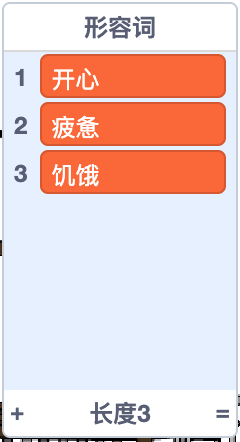

## 更多的诗歌

你的诗太短了 - 让我们添加一些！

--- task ---

让我们在诗歌的下一行中使用副词。 **副词** 是描述动词的单词。 创建另一个名为副词的列表，并添加以下三个单词：


--- /task ---

--- task ---

将此行添加到您的计算机代码中，使它在诗歌的下一行说一个随机副词：


```blocks3
when this sprite clicked
say [这是你的诗...] for (2) seconds
say (join [我 ](item (pick random (1) to (length of [动词 v])) of [动词 v])) for (2) seconds
+say (item (pick random (1) to (length of [副词 v])) of [副词 v]) for (2) seconds
```

--- /task ---

--- task ---

多次测试你的代码。 每次您都会看到一首随机生成地诗。


--- /task ---

--- task ---

在您的项目中添加一个名词列表。 **名词**是一个地方或事物。


--- /task ---

--- task ---

添加代码以在诗歌中使用名词。


```blocks3
when this sprite clicked
say [这是你的诗...] for (2) seconds
say (join [我 ](item (pick random (1) to (length of [动词 v])) of [动词 v])) for (2) seconds
say (item (pick random (1) to (length of [副词 v])) of [副词 v]) for (2) seconds
+say (join [在 ](item (pick random (1) to (length of [名词 v])) of [名词 v])) for (2) seconds
```

--- /task ---

--- task ---

在您的项目中添加一个形容词列表。 **形容词** 是一个描述性的词。



--- /task ---

--- task ---

添加代码以在诗歌中使用形容词。


```blocks3
when this sprite clicked
say [这是你的诗...] for (2) seconds
say (join [我 ](item (pick random (1) to (length of [动词 v])) of [动词 v])) for (2) seconds
say (item (pick random (1) to (length of [副词 v])) of [副词 v]) for (2) seconds
say (join [在 ](item (pick random (1) to (length of [名词 v])) of [名词 v])) for (2) seconds
+ say (join [我觉得 ](item (pick random (1) to (length of [形容词 v])) of [形容词 v])) for (2) seconds
```

--- /task ---

--- task ---

您可以单击列表旁边的复选框将其隐藏。


--- /task ---

--- task ---

测试您的新诗。

--- /task ---