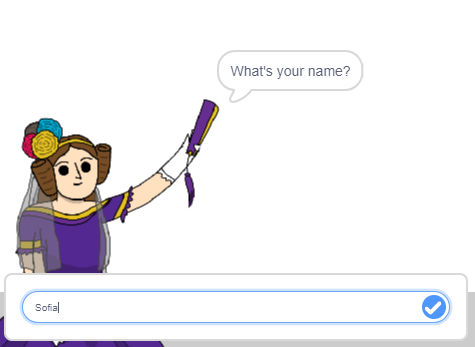

## 告訴Ada你的名字

Ada介紹了自己，但她不知道你的名字！

\--- task \---

拖動`詢問` {：class =“ block3sensing”}塊（來自` sensing ` {：class =“ block3sensing”}部分）添加到您的代碼中。 你的程式看起來應該像這樣：


```blocks3
when this sprite clicked
say [Hi, I'm Ada!] for (2) seconds
+ ask [What's your name?] and wait
```

\--- /task \---

\--- task \---

現在，點擊綠色旗標來測試您的程式。 艾達（Ada）應該問您您的名字，您可以輸入！



\--- /task \---

\--- task \---

我們可以使用**變量**存儲您的名字。 點擊`變量` {：class =“ block3variables”}，然後“製作變量”。 由於此變量將用於存儲您的姓名，因此我們將該變量稱為... `名稱` {：class =“ block3variables”}！

[[[generic-scratch3-add-variable]]]

\--- /task \---

\--- task \---

要存儲您的姓名，請單擊`變量` {：class =“ block3variables”}標籤，然後拖動`設置名稱` {：class =“ block3variables”}阻止到代碼末尾。


```blocks3
when this sprite clicked
say [Hi, I'm Ada!] for (2) seconds
ask [What's your name?] and wait
+ set [name v] to [0]
```

\--- /task \---

\--- task \---

使用` answer ` {：class =“ block3sensing”}塊存儲您鍵入的答案。


```blocks3
when this sprite clicked
say [Hi, I'm Ada!] for (2) seconds
ask [What's your name?] and wait
set [name v] to (answer :: +)
```

\--- /task \---

\--- task \---

單擊Ada測試您的代碼，並在詢問時輸入您的姓名。 還要詢問玩家的姓名，把它儲存在`名稱`{:class="block3variables"}變數裡。


\--- /task \---

\--- task \---

現在，您可以在代碼中使用您的名字了。 找到這段代碼：


```blocks3
when this sprite clicked
say [Hi, I'm Ada!] for (2) seconds
ask [What's your name?] and wait
set [name v] to (answer)
+say (join [Hi ] (name)) for (2) seconds 
```

要創建此代碼：

1. 拖動`聯接` {：class =“ blockoperators”}阻止`語句` {：class =“ blocklooks”}塊
    
    ```blocks3
    say (join [apple] [banana] :: +) for (2) seconds
    ```

2. 拖動`聯接` {：class =“ blockoperators”}阻止`語句` {：class =“ blocklooks”}塊.
    
    ```blocks3
    say (join [Hi] (name :: variables +)) for (2) seconds
    ```

\--- /task \---

\--- task \---

隱藏您的`名稱` {：class =“ block3variables”}變量，單擊變量旁邊的對勾。


\--- /task \---

\--- task \---

測試您的新程式。 Ada 應該用你的名字跟你打招呼！


如果單詞“ Hi”和您的名字之間沒有空格，則需要自己在代碼中添加空格！

\--- /task \---

\--- task \---

最後，添加以下代碼以說明下一步做什麼：


```blocks3
when this sprite clicked
say [Hi, I'm Ada!] for (2) seconds
ask [What's your name?] and wait
set [name v] to (answer)
say (join [Hi ] (name)) for (2) seconds 
+ say [Click the computer to generate a poem.] for (2) seconds 
```

\--- /task \---

\--- task \---

最後一次測試Ada的代碼，以確保一切正常。

\--- /task \---