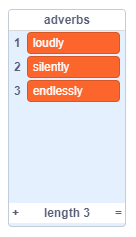
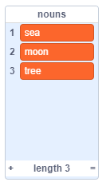
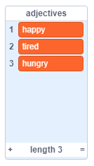

## 更多的詩

您的詩很短-讓我們加一首吧！

\--- task \---

讓我們在詩歌的下一行中使用副詞。 **副詞**是描述動詞的單詞。 創建另一個名為副詞的列表，並添加以下三個單詞：



\--- /task \---

\--- task \---

將此行添加到計算機的代碼中，以便在詩歌的下一行說一個隨機副詞：


```blocks3
when this sprite clicked
say [Here is your poem...] for (2) seconds
say (join [I ](item (pick random (1) to (length of [verbs v])) of [verbs v])) for (2) seconds
+say (item (pick random (1) to (length of [adverbs v])) of [adverbs v]) for (2) seconds
```

\--- /task \---

\--- task \---

測試您的代碼幾次。 您應該每次都獲得一個新的隨機用戶名。


\--- /task \---

\--- task \---

在項目中添加名詞列表。 **名詞**是一個地方或事物。



\--- /task \---

\--- task \---

添加代碼以在詩歌中使用名詞。


```blocks3
when this sprite clicked
say [Here is your poem...] for (2) seconds
say (join [I ](item (pick random (1) to (length of [verbs v])) of [verbs v])) for (2) seconds
say (item (pick random (1) to (length of [adverbs v])) of [adverbs v]) for (2) seconds
+say (join [by the ](item (pick random (1) to (length of [nouns v])) of [nouns v])) for (2) seconds
```

\--- /task \---

\--- task \---

在項目中添加形容詞列表。 **形容詞**是一個形容詞。



\--- /task \---

\--- task \---

添加代碼以在詩歌中使用形容詞。


```blocks3
when this sprite clicked
say [Here is your poem...] for (2) seconds
say (join [I ](item (pick random (1) to (length of [verbs v])) of [verbs v])) for (2) seconds
say (item (pick random (1) to (length of [adverbs v])) of [adverbs v]) for (2) seconds
say (join [by the ](item (pick random (1) to (length of [nouns v])) of [nouns v])) for (2) seconds
+ say (join [I feel ](item (pick random (1) to (length of [adjectives v])) of [adjectives v])) for (2) seconds
```

\--- /task \---

\--- task \---

您可以單擊列表旁邊的框將其隱藏。


\--- /task \---

\--- task \---

測試你的新程式。

\--- /task \---